# Migration Plan: HistopathologySystem to ASP.NET Core .NET 10 (Razor Pages) with Entra ID SAML 2.0

## Context

The current application is a legacy ASP.NET Web Forms app (VB.NET, `TargetFrameworkVersion v4.0`) using Windows Authentication. It is a 3-project solution. **The target stack for the new application is C# (ASP.NET Core .NET 10, Razor Pages)** — all VB.NET code being carried forward must be converted/rewritten in C#, not just recompiled against the new framework.

- **HistopathologySystem** — Web Forms UI project (64 `.aspx` pages)
- **HistopathologyLib** — business/domain layer
- **libDataAccess** (DataAccessLib) — ADO.NET data access layer

### Current authentication/authorization flow

- `web.config`: `<authentication mode="Windows"/>`, `<allow users="*"/>`. No Forms auth, no Membership/RoleManager, no `WindowsIdentity`/`WindowsPrincipal`/`IsInRole` usage anywhere.
- [VLAHeader.ascx.vb](VLAHeader.ascx.vb#L79-L180) `getUserDetails()` reads `HttpContext.Current.User.Identity.Name` (`DOMAIN\user`), strips the domain via `GetLoggedOnUser()` in [Common.vb](Common.vb#L645), then looks up the user via stored procedure `GetUserByNTLogin` ([HistopathologyLib/clsUser.vb](HistopathologyLib/clsUser.vb#L48-L110)) returning `UserID`, `Name`, `GroupCode`, `GroupName`, `Email`, `UserArea`, `AreaName`, `Active`.
- Results are stored in Session ([SessionVars.vb](SessionVars.vb)): `SV_HeaderUserName`, `SV_HeaderGroupName`, `SV_HeaderGroupID`, `SV_HeaderUserID`, `SV_HeaderUserEmail`, `SV_HeaderUserArea`, `SV_HeaderUserAreaID`.
- Inactive/unknown users are redirected to `unauthorized.htm`.
- Roles (`GroupName`): `Customer`, `Histopathology User`, `Maintenance`. Per-page `CheckPermissions()` (e.g. [ArchiveMenu.aspx.vb](ArchiveMenu.aspx.vb#L43), `ArchiveBlocks.aspx.vb` line 709, ~20+ pages) does a `Select Case` on `Session(SV_HeaderGroupName)` and redirects to `Home.aspx` if denied. [Home.aspx.vb](Home.aspx.vb) `EnableControls()` shows/hides menu links using the same check.
- Logout: `RemoveSessionVars()` ([Common.vb](Common.vb#L921)) clears all `SV_*` session keys.
- No master pages — `VLAHeader.ascx`/`VLAFooter.ascx` are manually included on every page.

### Data access layer

- [DataAccessLib/clsDataAccess.vb](DataAccessLib/clsDataAccess.vb) — `Shared` (static) class, `System.Data.SqlClient`, synchronous only, uses deprecated `System.Configuration.ConfigurationSettings.AppSettings("DBConnectionString")`. Custom `ParameterList`/`UpdateParameterList` classes wrap ADO.NET parameters. All access is via stored procedures (no EF, no dynamic SQL of note). `libDataAccess` has no `System.Web` dependency (portable).

### Out of scope for this plan

- Crystal Reports 13 (9 reports, export-to-PDF pattern) — needs its own replacement/licensing plan.
- Full 64-page Razor Pages UI conversion — high-level only.
- Full session/workflow-state redesign (50+ `Session(SV_*)` keys) — high-level only.
- Full VB.NET → C# conversion of all business logic — this plan covers the auth-related pieces only ([Common.vb](Common.vb), [HistopathologyLib/clsUser.vb](HistopathologyLib/clsUser.vb), [DataAccessLib/clsDataAccess.vb](DataAccessLib/clsDataAccess.vb)); the remaining VB.NET codebase conversion should be planned separately.

## User decisions

1. **SAML 2.0 is a hard requirement** (not OpenID Connect) — must integrate Entra ID via SAML.
2. **Scope**: focus deeply on authentication/authorization migration; rest of the app only at a high level.
3. **Migration strategy**: big-bang rewrite (build the new app fully, then cut over) — not incremental/strangler-fig.
4. **Data access**: keep existing stored procedures, modernize the DAL to `Microsoft.Data.SqlClient` + Dapper (no EF Core).
5. **Roles**: keep DB-driven roles (`GroupName` table), re-keyed by email/UPN claim instead of NTLogin.
6. **Language**: new solution is written in **C#** (not VB.NET); existing VB.NET classes are converted/rewritten as part of the port, not referenced as-is.

## Package research

- **Microsoft.Identity.Web** — OIDC only, not usable for SAML SP scenarios — not chosen since SAML is mandatory.
- **ITfoxtec.Identity.Saml2.MvcCore** (v4.20.1) — explicitly supports **.NET 10.0**/9/8/7/6 and .NET Framework 4.6.2/4.8, actively maintained, has Entra ID (Azure AD) SAML interop, `AddSaml2`/`UseSaml2` ASP.NET Core integration helpers, sample `TestWebAppCore`. **Recommended choice.**
- **Sustainsys.Saml2.AspNetCore2** (v2.11.0) — only targets `net8.0`, last updated March 2025 (stale relative to .NET 10) — considered but not chosen.
- Optional: `ITfoxtec.Identity.Saml2.Cryptography` for Azure Key Vault/HSM certificate scenarios in production.

## Plan

```mermaid
flowchart LR
    subgraph A["Phase A - Entra ID & Solution Setup"]
        direction LR
        A1["1. Register Entra ID Enterprise App (SAML SSO)<br/>Entity ID / Reply URL / Metadata"]
        A2["2. Create new net10.0 C# solution<br/>Web (Razor Pages) + ClassLib + DataAccess"]
        A3["3. Add NuGet packages<br/>ITfoxtec.Identity.Saml2.MvcCore, Microsoft.Data.SqlClient, Dapper"]
        A1 --> A2 --> A3
    end

    subgraph B["Phase B - SAML2 Sign-in / Sign-out"]
        direction LR
        B1["4. Configure Program.cs<br/>Cookie auth + AddSaml2()"]
        B2["5. Implement Login / ACS / Logout / Metadata endpoints"]
        B3["6. Map SAML email/UPN claim to app identity"]
        B1 --> B2 --> B3
    end

    subgraph C["Phase C - Role & Permission Resolution"]
        direction LR
        C1["7. Convert clsDataAccess.vb to C# SqlDataAccess<br/>(SqlClient + Dapper)"]
        C2["8. Add GetUserByEmail stored proc"]
        C3["9. IClaimsTransformation<br/>appends GroupName/UserID/UserArea claims"]
        C4["10. Define authorization policies<br/>(replace CheckPermissions)"]
        C5["11. Apply policies via AuthorizeFolder conventions"]
        C1 --> C2 --> C3 --> C4 --> C5
    end

    subgraph D["Phase D - Supporting Concerns"]
        direction LR
        D1["12. SAML Single Logout (SLO)"]
        D2["13. Session/workflow state redesign (deferred detail)"]
        D3["14. Certificate strategy (dev vs Key Vault prod)"]
        D4["15. Test SP-initiated & IdP-initiated flows"]
        D1 --> D2 --> D3 --> D4
    end

    A3 --> B1
    B3 --> C1
    C5 --> D1

    style A fill:#e3f2fd,stroke:#1565c0
    style B fill:#e8f5e9,stroke:#2e7d32
    style C fill:#fff3e0,stroke:#ef6c00
    style D fill:#fce4ec,stroke:#ad1457
```

### Phase A — Entra ID & Solution Setup

1. Register an Entra ID **Enterprise Application (SAML SSO)**: Entra admin center → Enterprise Applications → New non-gallery app → Set up single sign-on → SAML. Configure Identifier (Entity ID), Reply URL (ACS), e.g. `https://<new-app-host>/Saml2/Acs`, and Sign-on URL. Download the Federation Metadata XML and Entra ID signing certificate.
2. Create a new solution (e.g. `HistopathologySystem.Core`) targeting `net10.0`, **all projects in C#**:
   - Web project (Razor Pages, C#)
   - Class library — C# rewrite of the relevant parts of [HistopathologyLib](HistopathologyLib) (VB.NET → C# conversion, not a straight port)
   - Data access project — C# rewrite of [DataAccessLib](DataAccessLib) (VB.NET → C# conversion)
3. Add NuGet packages to the Web project:
   - `ITfoxtec.Identity.Saml2.MvcCore`
   - `ITfoxtec.Identity.Saml2.Cryptography` (optional, for Key Vault certs)
   - `Microsoft.Data.SqlClient`
   - `Dapper`
   - A distributed session/cache package (e.g. `Microsoft.Extensions.Caching.SqlServer` or `Microsoft.Extensions.Caching.StackExchangeRedis`) if session state is retained

### Phase B — SAML2 Sign-in/Sign-out (depends on Phase A)

4. In `Program.cs`: configure cookie authentication as the default scheme, and add `.AddSaml2()` bound from configuration (Entity ID, Single Sign-On/Single Logout destinations, signature algorithm, IdP certificate from Entra ID federation metadata, SP signing/decryption certificate).
5. Implement Login / Assertion Consumer Service (ACS) / Logout / Metadata endpoints following the ITfoxtec `TestWebAppCore` sample; call `HttpContext.SignInAsync` (cookie scheme) after validating the SAML response.
6. Map SAML claims to the app identity: use the email/UPN claim from the Entra ID SAML response as the primary key, replacing `GetLoggedOnUser()`/NTLogin extraction in [Common.vb](Common.vb#L645).

### Phase C — Role & Permission Resolution (depends on Phase B; DAL port can run in parallel with Phase A)

7. Convert [DataAccessLib/clsDataAccess.vb](DataAccessLib/clsDataAccess.vb) from VB.NET into a modern async **C#** `SqlDataAccess` class using `Microsoft.Data.SqlClient` + Dapper, in the new DataAccess project.
8. Add/modify a stored procedure to resolve users by email/UPN instead of NTLogin — a new `GetUserByEmail` mirroring [clsUser.vb GetUserByNTLogin](HistopathologyLib/clsUser.vb#L48-L110)'s output columns (`UserID`, `GroupName`, `Email`, `UserArea`, `AreaName`, `Active`). Confirm the `Email` column is populated and unique for all active users. The C# equivalent of `clsUser.GetUserByNTLogin` becomes a C# `UserRepository.GetUserByEmailAsync` method.
9. Implement an `IClaimsTransformation` (e.g. `HistopathologyClaimsTransformation`) that runs once per sign-in: calls the new DAL method and appends custom claims (`GroupName`, `UserID`, `UserArea`, `AreaName`) to the `ClaimsPrincipal` — replacing the `Session(SV_Header*)` pattern. Reject inactive/unknown users by redirecting to an Access Denied page (replaces `unauthorized.htm`).
10. Define authorization policies in `Program.cs` (e.g. `HistopathologyUserOrMaintenance`, `MaintenanceOnly`) via `RequireClaim("GroupName", ...)` or a custom `IAuthorizationRequirement`/handler — replacing the `CheckPermissions()` `Select Case` pattern used across ~20+ pages (e.g. [ArchiveMenu.aspx.vb](ArchiveMenu.aspx.vb#L43)).
11. Apply policies via Razor Pages folder conventions (`options.Conventions.AuthorizeFolder(...)`) instead of per-page checks, mirroring the existing Customer/Histopathology User/Maintenance structure.

### Phase D — Supporting concerns (light-touch/informational)

12. Implement SAML Single Logout (SLO) via ITfoxtec logout endpoints; clear the auth cookie (and session, if any) — replaces `RemoveSessionVars()` ([Common.vb](Common.vb#L921)).
13. Session/workflow state: recommend replacing the 50+ `Session(SV_*)` keys with per-page ViewModels/TempData or a scoped workflow context service; if session is retained, use a distributed session backing store (InProc will not survive scale-out or slot swaps). Detail deferred — not deep scope of this plan.
14. Certificates: use a self-signed dev certificate locally; use an Azure Key Vault-backed certificate for production SP signing/decryption (via `ITfoxtec.Identity.Saml2.Cryptography` or `Azure.Security.KeyVault.Certificates`).
15. Testing: validate both SP-initiated and IdP-initiated SAML flows against an Entra ID test tenant before pointing at the production tenant.

## Existing user migration

```mermaid
flowchart LR
    Start(["Existing user opens app URL"]) --> Redirect["Redirected to Entra ID login (SAML SSO)"]
    Redirect --> SSO{"Already signed into<br/>Windows/Office 365?"}
    SSO -- "Yes" --> Silent["Silent SSO - no prompt"]
    SSO -- "No" --> Prompt["User signs in<br/>(+ MFA if enabled)"]
    Silent --> Assertion["SAML assertion posted to ACS<br/>(email/UPN claim)"]
    Prompt --> Assertion

    Assertion --> Lookup["IClaimsTransformation calls<br/>GetUserByEmailAsync(email)"]

    Lookup --> Found{"Match found in<br/>Users table?"}
    Found -- "No" --> Denied1["Access Denied page"]
    Found -- "Yes" --> Active{"Active = true?"}
    Active -- "No" --> Denied2["Access Denied page"]
    Active -- "Yes" --> Claims["Attach claims:<br/>GroupName, UserID, UserArea"]

    Claims --> Policy["Authorization policy checks<br/>(Customer / Histopathology User / Maintenance)"]
    Policy --> App(["User proceeds into app<br/>with role-scoped menu/pages"])

    style Start fill:#e3f2fd,stroke:#1565c0
    style App fill:#e8f5e9,stroke:#2e7d32
    style Denied1 fill:#ffebee,stroke:#c62828
    style Denied2 fill:#ffebee,stroke:#c62828
```

### How existing users map today vs. after migration

The existing Users table already stores an `Email` column (maintained via `UserMaintenance.aspx` → `AddUser`/`EditUser` stored procs, see [HistopathologyLib/clsUser.vb](HistopathologyLib/clsUser.vb#L72-L189)), so this is a re-keying exercise rather than a rebuild — no new user table or provisioning system is needed.

| | Today (Windows Auth) | After (Entra ID SAML) |
|---|---|---|
| Identity source | IIS Windows auth → `DOMAIN\username` | Entra ID SAML assertion → email/UPN claim |
| Lookup key | `NTLogin` column | `Email` column (already exists in the same Users table) |
| Lookup call | `clsUser.GetUserByNTLogin` ([HistopathologyLib/clsUser.vb](HistopathologyLib/clsUser.vb#L72-L122)) | New `GetUserByEmail` (same output shape) |
| Storage of user context | `Session(SV_Header*)` | Claims on `ClaimsPrincipal` via `IClaimsTransformation` |
| Denied/unknown user | Redirect to `unauthorized.htm` | Redirect to Access Denied page |

### Migration steps for existing users

1. **Data reconciliation (before go-live) — critical path.** Export the Users table (`ID`, `NTLogin`, `Name`, `Email`, `GroupName`, `Active`) and compare `Email` against each user's actual Entra ID UPN/mail attribute. This `Email` field was historically free-text entered via `UserMaintenance.aspx` and may be stale, blank, or mismatched (case, alias vs. primary SMTP, etc.) — this is the single biggest migration risk (see "Further considerations" below). Normalize/correct mismatches via a one-time DB update (e.g., cross-reference against Entra ID via Microsoft Graph API export) before cutover.
2. **New stored procedure.** Add `GetUserByEmail` (mirrors `GetUserByNTLogin`'s columns) so the C# `UserRepository.GetUserByEmailAsync` can resolve the same `UserID`/`GroupName`/`UserArea`/`Active` info, just keyed differently.
3. **First-login experience for an existing user.** User hits the new app → redirected to Entra ID login (SSO — likely silent if already signed into Windows/Office 365). SAML assertion returns → `IClaimsTransformation` calls `GetUserByEmailAsync(email)`:
   - **Match found + Active** → claims (`GroupName`, `UserID`, `UserArea`) are attached; user proceeds exactly as before (menu still scoped to Customer/Histopathology User/Maintenance).
   - **Match found but Active = false** → Access Denied (same as legacy inactive-account behavior).
   - **No match** → Access Denied. Step 1's reconciliation is meant to prevent this case.
4. **No password/credential migration needed.** Moving from Windows Integrated Auth to Entra ID SSO means no password reset or credential provisioning step — Entra ID already manages the corporate identity. The only "migration" work is the data linkage (NTLogin-keyed → Email-keyed) inside the app's own Users table.
5. **UserMaintenance equivalent going forward.** Since `NTLogin` becomes irrelevant post-cutover, the future Razor Pages "User Maintenance" admin page should require/validate `Email` as the primary identifier for new users (mandatory, format-validated) instead of `NTLogin`. The `NTLogin` column can be retained for audit/history but stops being used for lookups.
6. **Cutover approach (consistent with the big-bang decision).** All users move at once when the new app goes live — there is no dual-running period where some users are on Windows Auth and others on SAML, so the pre-cutover data reconciliation (step 1) is critical; an unreconciled user is fully locked out until fixed. Recommend a **dry-run**: run the reconciliation script ahead of the cutover date and produce a report of "users with no confident Entra ID email match" so admins can fix DB records or Entra ID user profiles before go-live.
7. **Communication.** Login UX changes (Windows-invisible auth → a visible Entra ID login screen, possibly with MFA if enabled on the tenant) — send a short notice to users ahead of cutover explaining the new sign-in screen they'll see the first time.

### New user entry

New users follow the **same sign-in flow** as existing users (Entra ID SSO → email lookup → claims), but need a **provisioning step first** — unlike existing users, there's no legacy row to reconcile since a brand-new user won't exist in the Users table yet.

```mermaid
flowchart LR
    A1["Admin creates new user in<br/>User Maintenance page"] --> A2["Set Email (must match Entra ID UPN),<br/>GroupName, UserArea, Active = true"]
    A2 --> A3["Row saved in Users table<br/>(pre-provisioned, not yet logged in)"]

    A3 --> B1["New user opens app URL<br/>(first login)"]
    B1 --> B2["Redirected to Entra ID login (SAML SSO)"]
    B2 --> B3["SAML assertion posted to ACS<br/>(email/UPN claim)"]
    B3 --> B4["IClaimsTransformation calls<br/>GetUserByEmailAsync(email)"]

    B4 --> C1{"Match found &<br/>Active = true?"}
    C1 -- "Yes" --> C2["Claims attached:<br/>GroupName, UserID, UserArea"]
    C2 --> C3(["User proceeds into app<br/>with role-scoped menu/pages"])
    C1 -- "No (not provisioned<br/>or email mismatch)" --> C4["Access Denied page"]

    style A1 fill:#e3f2fd,stroke:#1565c0
    style A2 fill:#e3f2fd,stroke:#1565c0
    style A3 fill:#e3f2fd,stroke:#1565c0
    style C3 fill:#e8f5e9,stroke:#2e7d32
    style C4 fill:#ffebee,stroke:#c62828
```

**Recommended approach: Admin pre-provisions (Option 1)** — mirrors how [UserMaintenance.aspx](UserMaintenance.aspx) already works today (admin manually adds users with `NTLogin`, `GroupName`, `Email`, `UserArea`).

- Admin creates the new user via the User Maintenance page **before** the person's first login: sets `Email` (must match their Entra ID UPN), `GroupName` (role), `UserArea`, `Active = true`.
- On the new user's first login, Entra ID authenticates them → email claim comes back → `GetUserByEmailAsync` finds the pre-provisioned row → claims attached → access granted.
- If Entra ID and the app admin get out of sync (wrong email entered, or user not yet in Entra ID), the same Access Denied path applies as for an unreconciled existing user.
- **Pros:** No app logic changes beyond what's already planned; role assignment stays controlled by app admins (important since roles like "Maintenance" are sensitive); one consistent sign-in flow for both existing and new users.
- **Cons:** Manual step — admin must remember to provision before the user's first login attempt (a "day 1" new hire could be blocked if IT hasn't set up their app record yet).

**Alternative considered: Just-In-Time (JIT) provisioning (Option 2, not chosen for initial migration)**
- On first login, if `GetUserByEmailAsync` finds no match, auto-create a Users row from SAML claims (email, name) with a default/no role, then redirect to a "pending approval" page or notify an admin to assign a role.
- **Pros:** No manual pre-step; user existence auto-syncs with Entra ID.
- **Cons:** More complexity (new claims-transformation branch, "pending" state, admin approval workflow, new UI) — this is new functionality not present in the legacy app.

**Decision:** Use Option 1 (admin pre-provisioning) for the initial migration — it keeps parity with the existing admin-driven model, fits the "big-bang, scope = auth/authz only" decision, and defers JIT provisioning as a **future enhancement** if onboarding volume ever makes manual provisioning a bottleneck.

## Relevant files (existing, to reference/port)

- [Web.config](Web.config)
- [Global.asax.vb](Global.asax.vb)
- [VLAHeader.ascx.vb](VLAHeader.ascx.vb)
- [Common.vb](Common.vb) (`GetLoggedOnUser`/`RemoveSessionVars`)
- [HistopathologyLib/clsUser.vb](HistopathologyLib/clsUser.vb) (`GetUserByNTLogin`)
- [SessionVars.vb](SessionVars.vb)
- [DataAccessLib/clsDataAccess.vb](DataAccessLib/clsDataAccess.vb)
- [Home.aspx.vb](Home.aspx.vb)
- [ArchiveMenu.aspx.vb](ArchiveMenu.aspx.vb) (`CheckPermissions` pattern)

## Verification

1. Entra ID Enterprise App SAML config check: Identifier/Reply URL match the app's `/Saml2/Acs`; validate Federation Metadata.
2. Local dev end-to-end: protected page → redirect to Entra login → SAML POST to ACS → cookie issued → claims populated (diagnostic `/whoami` page shows `GroupName`/`UserArea`).
3. Negative test: user not in DB / inactive → Access Denied page.
4. Authorization test: Customer role denied access to a Maintenance-only page.
5. Logout test: SLO clears both the Entra ID session and the local cookie.
6. DAL test: new SqlDataAccess+Dapper method against the same stored procedures, compare result shape to the legacy implementation.

## Decisions

- `ITfoxtec.Identity.Saml2.MvcCore` chosen over `Sustainsys.Saml2.AspNetCore2` (.NET 10 support + actively maintained vs Sustainsys's net8-only, stale package).
- Big-bang rewrite; legacy app stays live/unchanged during development.
- DAL modernized to `Microsoft.Data.SqlClient` + Dapper, keeping existing stored procedures, no EF Core.
- Roles remain DB-driven, keyed by email/UPN claim instead of NTLogin.
- New solution is written entirely in **C#**; VB.NET source is converted, not carried forward or referenced via interop.
- Scope is auth/authz-focused; full 64-page migration, Crystal Reports replacement, and full session redesign are out of scope here — to be planned separately.

## Further considerations

1. Crystal Reports (9 reports) needs its own replacement/licensing plan — unrelated to auth, recommend a separate follow-up plan.
2. Confirm the Entra ID SAML assertion will reliably include a claim matching the DB's existing `Email` column for every current user; may need a one-time Users table reconciliation before cutover.
</content>
