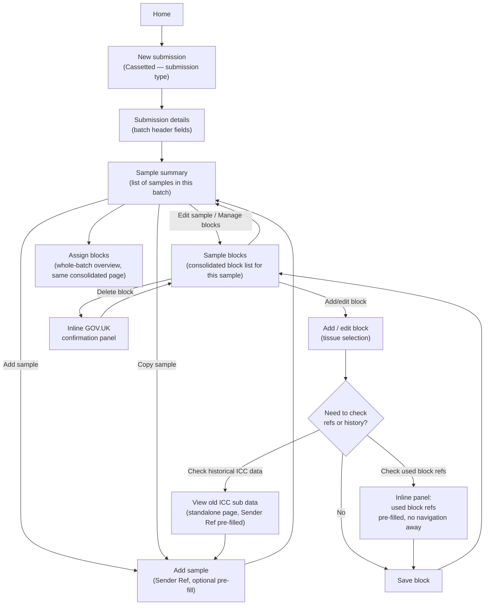

# TSE/NON-TSE Submission Workflow — GDS-Aligned Redesign

**Date:** 2026-08-28 (revised)
**Scope:** New TSE/NON-TSE Submission journey — Submission type, Submission details, Sample summary, Add sample, Blocking (block details), Search block refs, View old ICC_Sub data.
**Status:** Living document — Section 7 tracks what has actually shipped since the original 2026-08-27 proposal; the rest reflects the current, revised recommendation.

---

## 1. Legacy workflow reviewed

The legacy workflow as run today:

1. **Create Submission** → TSE Submission → Submission Type → Batch Details → Sample Summary.
2. On **Sample Summary**: click **Add Sample** → opens `AddSubmission.aspx` → enter a sample reference → Save and continue.
3. Click **Add Block** → opens `submissionDetailsBlock.aspx` → navigates to `BlockDetails.aspx`.
4. On **BlockDetails.aspx**: select a tissue from a dropdown → Save block details → return to `submissionDetailsBlock.aspx` → verify the block/tissue is displayed.
5. On `submissionDetailsBlock.aspx`: click **Block Ref Search** → navigates to `SearchBlockRef.aspx` → perform a block reference search.
6. On **Search Block Refs**: verify search functionality.
7. Click **View Old ICC Sub Data** → opens a **popup window** → displays `viewImportedDatas.aspx` → search/view historical imported data.

### Legacy screen inventory referenced by this review
- New TSE Submission → Submission Samples → Sample Summary
- New TSE Submission → Submission Samples → Blocking → Block Details
- New TSE Submission → Submission Samples → Blocking → Search Block Refs

---

## 2. Usability issues and pain points

1. **Sample creation and block creation are on entirely separate pages with a hard save-and-reload between them.** `AddSubmission.aspx`/`AddSample.aspx` only capture the Sender Ref; the user must save, land back on Sample Summary, then start a *second*, unrelated task (Add Block) to do anything useful with the sample they just created.
2. **Two near-duplicate "block list" screens** (`submissionDetailsBlock.aspx` and `BlockDetails.aspx`) exist for what the user experiences as one task — "manage this sample's blocks." The legacy split forces a redundant hop with no added capability at either stop.
3. **Block ref search is a disconnected detour, not an in-context lookup.** `SearchBlockRef.aspx` lives under the generic Search menu. To check whether a block reference is already used, the user must abandon the in-progress block form, re-type the Sender Ref/Histology Ref from memory, read the result, then navigate all the way back — losing their place and any unsaved input.
4. **"View Old ICC Sub Data" is a popup window.** Popups are blocked by default in most browsers, are invisible to screen readers unless focus is explicitly managed, cannot be deep-linked, and break the back button — all directly contrary to WCAG 2.2 and the GOV.UK Design System's guidance against new windows.
5. **Every step depends on hidden session state** (`SessionVars.SV_BatchID`, `SV_AnimalID`, etc.) rather than the URL. Pages cannot be bookmarked, refreshed safely, or opened in a new tab, and the browser back button frequently produces stale or incorrect data.
6. **No overview/progress indicator across the 6+ step journey** (Submission Type → Batch Details → Sample Summary → Add Sample → Add Block → Block Details), so users cannot see what is complete, what remains, or jump between sections — a forced linear wizard rather than a GDS task list.
7. **Destructive actions use the native browser `confirm()` dialog** — inconsistent styling, no heading, no assistive-technology announcement, and not stylable to match the rest of the service.
8. **At least one control auto-submits on change** (a checkbox toggling sort order), which fails WCAG 3.2.2 (On Input) and is disorienting for keyboard/screen-reader users.

---

## 3. Recommended simplified GDS-compliant user journey

### Principles applied
- **One thing per page** — Submission Type is its own step; batch header fields are their own step; sample entry is its own step.
- **Consolidate near-duplicate screens** — one page owns "manage this sample's blocks," not two.
- **In-context lookups, not screen jumps** — block ref checks and historical ICC data become inline, pre-filled, collapsible lookups (`govuk-details`) on the page where the user needs them, not a detour to a different menu area or a popup.
- **No new windows** — every screen is a normal, addressable page reachable via ordinary navigation and the browser back button.
- **Route/query-based state, not hidden session state** — `batchId`/`animalId` travel as URL parameters so pages are bookmarkable and safe to refresh or open in a new tab.
- **GOV.UK confirmation patterns, not native dialogs** — inline `govuk-warning-text` + explicit confirm/cancel buttons for every delete action.
- **No control changes state without an explicit user action** — every toggle is followed by an explicit "Apply"/"Save" button, never an auto-submit.

### Recommended screen consolidation

| Legacy screens | Recommendation |
|---|---|
| `AddSubmission.aspx` (typed Sender Ref) + `AddSample.aspx` (Sender Ref via search/copy) | **One page.** Both are "add a sample by Sender Ref to this batch" — the only difference is where the Sender Ref value comes from (typed vs. pre-filled from a search/copy action), which is a single optional query parameter, not a reason for two pages. |
| `submissionDetailsBlock.aspx` + `BlockDetails.aspx` | **One page.** Both render the same block list (block ref, customer ref, comment, repeat, status) for the same batch — one scoped to a single sample, one to the whole batch. A single page with an optional "sample" scope (all fields present either way, just filtered) replaces both, with a "Manage sample" action to move from the whole-batch view into a specific sample's view. |
| `SearchBlockRef.aspx` (standalone menu page) | **Keep as a standalone page** for ad-hoc search from the Search menu, but **add an inline "Check used block refs" expandable panel** directly on the block add/edit screen, pre-filled with the current sample's Sender Ref/Histology Ref — no navigation away needed for the common case. |
| `viewImportedDatas.aspx` (popup) | **Convert to a standalone page**, reached via a normal link/new-tab-safe anchor from the Add Sample screen with the Sender Ref pre-filled, returning to the same point — never a `window.open` popup. |
| Native `confirm()` on every Delete | **Replace** with an inline GOV.UK confirmation panel (warning text + Yes/Cancel buttons) on the same page. |
| Auto-submitting sort-order checkbox | **Replace** with checkbox + explicit "Apply" button. |

---

## 4. Alternatives to popups and excessive navigation

| Popup / extra navigation removed | Replacement |
|---|---|
| `viewImportedDatas.aspx` popup window | Standalone page, opened via a normal link with the Sender Ref carried as a query parameter — accessible, bookmarkable, works with browser back/forward, no popup-blocker interference. |
| Full page navigation to `SearchBlockRef.aspx` just to check one Sender Ref | Inline `govuk-details` "Check used block refs for this sample" panel directly on the block screen, pre-filled, expandable/collapsible without leaving the page. |
| Separate `BlockDetails.aspx` hop with no new capability | Removed — one consolidated block-management page reachable directly from the sample row. |
| Separate `AddSample.aspx` hop that only differs by pre-fill source | Removed — one Add sample page with an optional pre-fill parameter. |
| Native `confirm()` popup dialog | Inline, in-page GOV.UK warning/confirmation panel — no browser-native chrome, fully stylable and screen-reader friendly. |

---

## 5. Target-state workflow diagram

### Step-by-step target journey
1. **New submission** (`Cassetted`) — select submission type only.
2. **Submission details** (`BatchDetails`, create mode) — batch header fields.
3. **Sample summary** (`BatchBlockSummary`) — task-list-style view of every sample in the batch; Add sample / Edit sample / Copy sample / Delete sample from here.
4. **Add sample** — one page, Sender Ref (typed or pre-filled), Neuropath flag, with an inline "Check historical data for this sender ref" link.
5. **Sample blocks** — one consolidated page per sample: add/edit/delete blocks, assign tissue, inline "Check used block refs" panel, all without leaving the page.
6. **Assign blocks** (whole-batch view) — the same consolidated page, scoped to the whole batch instead of one sample, for the lab-workflow "assign blocks" step.

---

## 6. Expected usability, accessibility and completion-rate improvements

- **Fewer navigation hops per task.** Consolidating Add Sample/Add Sample-via-search into one page, and Block Details/Sample Blocks into one page, removes at least 2 full page round-trips per sample added and per block managed.
- **No popups.** Removing the ICC historical-data popup eliminates popup-blocker failures entirely and restores normal back-button/bookmark behaviour (WCAG 2.4.3 Focus Order, 2.1.1 Keyboard).
- **In-context lookups reduce lost work.** Pre-filled, inline "check refs"/"check history" panels mean the user never has to re-enter a Sender Ref they already typed, and never loses their place mid-task.
- **Predictability (WCAG 3.2.2).** Removing the auto-submitting checkbox and native `confirm()` dialogs means every state change is explicitly user-initiated and consistently styled/announced to assistive technology.
- **Resilience.** Route/query-based state instead of session-only state makes pages bookmarkable, shareable, and safe to use with the browser back button — reducing lost work and support calls from users who refreshed or navigated back mid-task.
- **Orientation.** A single "Sample summary" list with clear per-row actions gives users a persistent view of submission progress, rather than a memoryless linear wizard.
- **Consistency with GDS "Make it simple."** Every proposed component (`govuk-details`, `govuk-error-summary`, `govuk-warning-text` confirmation pattern, `govuk-button` groups) is an existing GOV.UK Design System pattern already in use elsewhere in this codebase — no bespoke UI, no new component risk.
- **No functionality is removed.** Every legacy capability (add sample, add block, tissue selection, block ref search, ICC historical lookup, copy/delete) remains available — only the number of screens and page-loads needed to reach them is reduced.

---

## 7. Implementation status (what has actually shipped)

| Recommendation | Status | Notes |
|---|---|---|
| Consolidate `BlockDetails.cshtml` + `SubmissionDetailsBlock.cshtml` | **Done** | `SubmissionDetailsBlock.cshtml` now supports an optional `AnimalId` — animal-scoped (full add/edit/delete/copy) when supplied, whole-batch overview (former `BlockDetails` behaviour, improved with a Sender Ref column) when omitted. `Blocks/BlockDetails.cshtml(.cs)` deleted; all callers repointed. |
| Inline "Check used block refs" panel | **Done** | Present on `SubmissionDetailsBlock.cshtml` as an expandable `govuk-details` panel, pre-filled with the current sample's Sender Ref — no navigation to `/Search/SearchBlockRefs` needed for the common case. |
| Consolidate `AddSubmission.cshtml` + `AddSample.cshtml` | **Done** | Both were near-duplicate "add a sample by Sender Ref" screens. `AddSample.cshtml(.cs)` deleted; `AddSubmission.cshtml.cs` now also accepts an optional `senderRef` query parameter (for the "Copy sample"/"Add to batch" pre-fill use cases) and gained the "Check historical data for this sender ref" link that only `AddSample` previously had. |
| Remove native `confirm()` dialogs | **Done** | Replaced with inline `govuk-warning-text` confirmation panels on `SubmissionDetailsBlock`/`BatchBlockSummary`. |
| Remove auto-submitting checkbox | **Done** | "Bypass sort" on `BatchBlockSummary` now requires an explicit "Apply" button. |
| Convert `viewImportedDatas.aspx` popup to a standalone page | **Done** | `Search/ViewImportedData.cshtml` is a normal page; linked from `AddSubmission.cshtml` with the Sender Ref pre-filled via the "Check historical data for this sender ref" link. |
| Route/query-based state instead of session-only | **Partially done** | `BatchId`/`AnimalId` are now route/query parameters (with session fallback) on `BatchBlockSummary`, `SubmissionDetailsBlock`, `BatchDetails`, `AddSubmission`. Some downstream pages (Copy blocks/samples) still rely on session state as their only source. |
| Task-list overview for the whole submission | **Not started** | `BatchDetails`/`BatchBlockSummary` currently split "submission details" and "samples" across two pages with button-based navigation rather than a single GDS task-list component. |

---

## 8. Compliance & governance notes

- Classified as **medium risk** under the Defra AI Toolkit — requires human review before merge, WCAG 2.2 AA verification (including screen-reader path), and PR disclosure of AI assistance per the [Defra AI Toolkit — Deliver with AI](https://digital.defra.gov.uk/ai-toolkit/deliver-with-ai) guidance.
- No bespoke UI is introduced anywhere in this proposal — every component (`govuk-details`, `govuk-error-summary`, `govuk-warning-text` confirmation pattern) is an existing GOV.UK Design System pattern already used elsewhere in this codebase.
