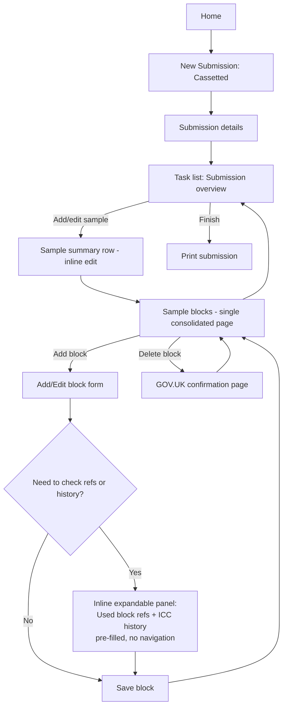

# TSE/NON-TSE Submission Workflow — GDS-Aligned Redesign Plan

**Date:** 2026-08-27
**Scope:** New TSE/NON-TSE Submission journey — Sample summary, Block details, Sample blocks, Search block refs, View old ICC_Sub data.
**Status:** Proposal for review — no functionality change, navigation/interaction redesign only.

---

## 1. Current-state page mapping

The legacy `.aspx` names in the requested workflow map to these already-migrated Razor Pages:

| Legacy step | Current page |
|---|---|
| New TSE Submission | [Batches/Cassetted.cshtml](../src/Histo.Web/Pages/Batches/Cassetted.cshtml) → [Batches/BatchDetails.cshtml](../src/Histo.Web/Pages/Batches/BatchDetails.cshtml) |
| Sample Summary | [Submissions/BatchBlockSummary.cshtml](../src/Histo.Web/Pages/Submissions/BatchBlockSummary.cshtml) |
| Add Block / Block Details | [Blocks/BlockDetails.cshtml](../src/Histo.Web/Pages/Blocks/BlockDetails.cshtml) |
| submissionDetailsBlock.aspx | [Submissions/SubmissionDetailsBlock.cshtml](../src/Histo.Web/Pages/Submissions/SubmissionDetailsBlock.cshtml) |
| Search Block Refs | [Search/SearchBlockRefs.cshtml](../src/Histo.Web/Pages/Search/SearchBlockRefs.cshtml) |
| View Old ICC Sub Data | [Search/ViewImportedData.cshtml](../src/Histo.Web/Pages/Search/ViewImportedData.cshtml) |

The migration already removed classic Web Forms popups — `ViewImportedData` is a standalone GDS page (see [Functionality-Traceability-Matrix.md](Functionality-Traceability-Matrix.md)) and no `window.open`/modal usage exists in the submission flow. The remaining problems are **navigation depth, duplicated screens, and non-GDS interaction patterns**.

---

## 2. Usability issues and pain points

1. **Two near-duplicate "block list" screens.** `SubmissionDetailsBlock.cshtml` and `Blocks/BlockDetails.cshtml` both render essentially the same table (block ref, customer ref, comment, repeat, status, delete) for the same sample, reached via different routes. A code comment in `SubmissionDetailsBlockModel` confirms the gap: *"Add/Edit/Copy/Block-ref-search actions from the legacy toolbar are not reproduced"* — today's `SubmissionDetailsBlock` page can list/delete blocks but not add or edit them, forcing users to guess which of two "Blocks" screens to use.
2. **Deeply linear, session-state-driven journey.** Every page relies on `Session.BatchID` / `Session.AnimalID` (see `LoadAnimalAsync` in `SubmissionDetailsBlock.cshtml.cs`) rather than a route parameter. Result: no bookmarkable/deep-linkable screens, unreliable browser back button, and a forced 5–6 level deep click path (Cassetted → BatchDetails → BatchBlockSummary → AddSample → SubmissionDetailsBlock → BlockDetails → "Done" all the way back).
3. **Search Block Refs is disconnected from the task.** It lives under the generic `/Search/SearchMenu` area, not linked from `SubmissionDetailsBlock` or `BlockDetails`. To check used block refs while adding a block, the user must abandon the in-progress submission, navigate to Search, re-type Sender ref/Histology ref, read the result, then re-navigate back — with no field pre-fill and no return link.
4. **"View Old ICC Sub Data" is similarly isolated** under Search, even though its main value is as a lookup aid *while entering a sample* (per the in-app help, "A lookup is available…").
5. **Native browser `confirm()` for destructive actions** — `onclick="return confirm('Delete this block?')"` appears in both `SubmissionDetailsBlock.cshtml` and `BlockDetails.cshtml`. Not a GOV.UK Design System pattern, not stylable/consistent, and poor for screen reader users (no heading, no focus management, inconsistent browser behaviour).
6. **Auto-submitting checkbox** — the "Bypass sort" checkbox in `BatchBlockSummary.cshtml` uses `onchange="this.form.submit()"`, violating WCAG 3.2.2 (On Input) and confusing keyboard/screen-reader users.
7. **No overview/progress indicator.** With 6+ steps from "new submission" to "block saved," users can't see what's done, what's outstanding, or jump between sections — no task list pattern.
8. **Repeated identical "Done"/"Back" labels** across every page with no breadcrumb or section context, so users can't easily tell which "Done" they're pressing or what it saves.

---

## 3. Recommended simplified GDS journey

### Principles applied
- **Task list pattern** instead of a forced linear wizard, so users can jump between "Submission details," "Samples," and see progress at a glance.
- **One page per thing the user is doing** — merge the two duplicate block-list pages into a single "Manage blocks for sample" page.
- **In-context lookups, not screen jumps** — Block ref search and ICC historical data become inline, collapsible lookups (reusing the `
` component already used for the tissue list in `BatchBlockSummary.cshtml`), pre-filled with the current sample's sender/histology ref.
- **GOV.UK confirmation pages, not `confirm()`** — replace JS dialogs with a proper "Are you sure you want to delete this block?" confirmation page.
- **No auto-submitting controls** — replace the auto-submit checkbox with an explicit "Apply" button, per WCAG 3.2.2.
- **Route/query-based state, not hidden session state** — pass `batchId`/`animalId` as route values so pages are shareable/bookmarkable and back-button-safe.

### Screens: consolidate / remove / replace

| Current | Action |
|---|---|
| `SubmissionDetailsBlock.cshtml` + `Blocks/BlockDetails.cshtml` | **Consolidate** into one "Blocks for this sample" page with add/edit/delete/copy, reached from the sample summary row |
| `SearchBlockRefs.cshtml` | **Keep as standalone page** for ad-hoc search from the Search menu, but **add an inline "Check used block refs" expandable panel** on the block add/edit page — pre-filled, no navigation away |
| `ViewImportedData.cshtml` | **Keep as standalone page**, but **add a contextual "View historical data for this sender ref" link** from Add Sample that deep-links with the sender ref pre-filled, and returns to the same point |
| Native `confirm()` on Delete (both files) | **Replace** with a GOV.UK confirmation page/pattern |
| Auto-submit "Bypass sort" checkbox | **Replace** with checkbox + explicit "Apply" button |

---

## 4. Target-state workflow diagram

---

## 5. Expected usability, accessibility and completion-rate improvements

- **Fewer navigation hops**: consolidating the two block screens and adding inline lookups removes at least 2 full page round-trips (Search menu detour, re-entry back through the wizard) per block added.
- **Orientation**: a task list gives users a persistent view of submission progress (WCAG 2.4.8 Location), instead of a memoryless linear wizard with identical "Done"/"Back" labels.
- **Predictability (WCAG 3.2.2)**: removing the auto-submitting checkbox and native `confirm()` dialogs means every state change is user-initiated and consistently styled/announced to assistive technology.
- **Resilience**: route/query-based state instead of session-only state makes pages bookmarkable and safe to use with the browser back button, reducing lost work and support calls.
- **Context preservation**: pre-filled, in-page lookups for block refs and ICC history mean users never lose their place mid-task.
- **Consistency with GDS "Make it simple"**: reuses an existing, already-implemented GOV.UK pattern (`
` expandable panels) rather than introducing new UI, keeping the change low-risk.

All existing functionality (add/edit/delete/copy blocks, block ref search, ICC historical view) is retained — this is a navigation/interaction redesign only, not a scope change.

---

## 6. Compliance & governance notes

- Classified as **medium risk** under the Defra AI Toolkit — requires human review before merge, WCAG 2.2 AA verification (including screen-reader path), and PR disclosure of AI assistance per the [Defra AI Toolkit — Deliver with AI](https://digital.defra.gov.uk/ai-toolkit/deliver-with-ai) guidance.
- No bespoke UI is introduced — all proposed components (`govuk-details`, `govuk-error-summary`, confirmation page pattern) are existing GOV.UK Design System patterns already in use elsewhere in this codebase.
